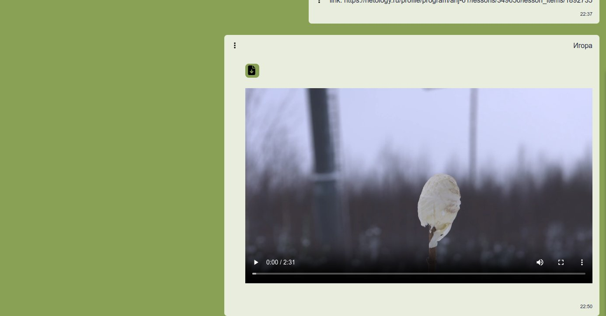
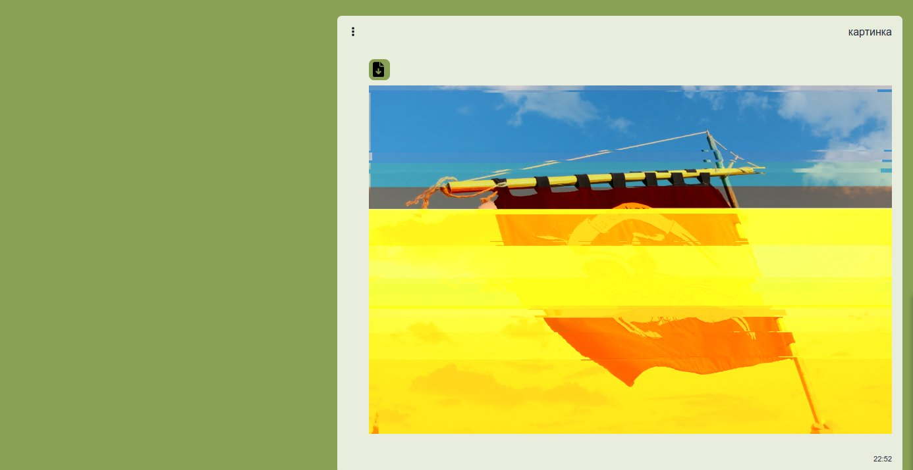
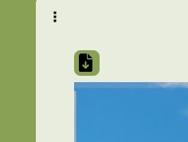
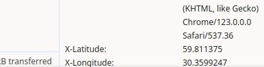
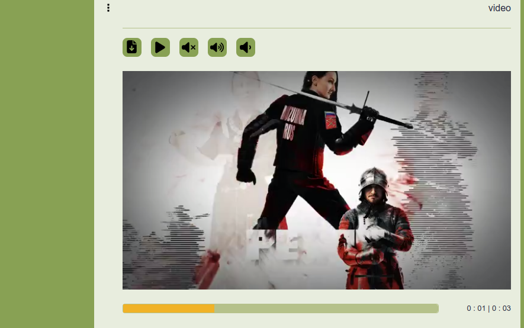

*CI* 

# Chaos Organizer

## Основные функции:

* ### Сохранение в истории ссылок и текстовых сообщений;
* ### Ссылки кликабельны и отображаются как ссылки;  
  
* ### Сохранение в истории изображений, видео и аудио;
  
  
  
  

* ### Скачивание файлов на компьютер пользователя;  

* ### Ленивая подгрузка;  

## Дополнительные функции:

* ### Поиск по сообщениям 

* ### Отправка геолокации;

* ### Воспроизведение видео/аудио,   
* ### замьючивание и регулировка громкости при помощи кастомных кнопок
* ### Отрисовка прогресса воспроизведения видео, аудио

* ### Закрепление (pin) сообщений

* ### Добавление сообщения в избранное

* ### Просмотр вложений по категориям: аудио, видео, изображения, другие файлы

* ### Кнопка для подключения дефолтной базы данных

